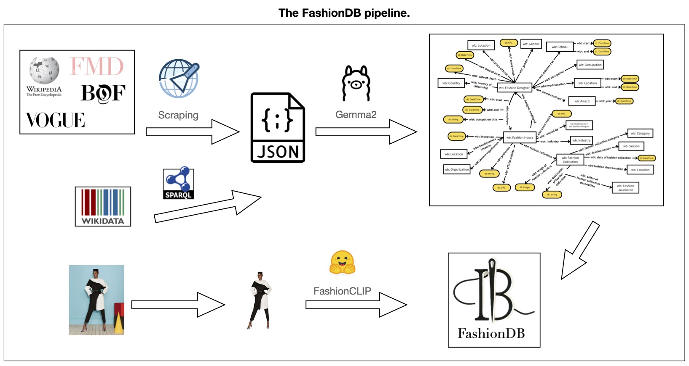

This repository stores the source code for the creation of FashionDB: a structured dataset about the recent history of fashion.<br/>


The data was scraped in October 2024.<br/>

Sources: <br/>
[Fashion Model Directory (FMD)](https://www.fashionmodeldirectory.com): a website storing information about fashion brands and fashion designers (up until 2019)<br/>
[Business of Fashion (BOF)](https://www.businessoffashion.com): a website storing articles and news from the fashion world<br/>
[Vogue](https://www.vogue.com): a website showcasing articles and news about fashion, it also has an archive on fashion collections<br/>
[Wikidata](https://www.wikidata.org/wiki/Wikidata:Main_Page): a knowledge graph related to Wikipedia hosted on a Wikibase <br/>
[Wikipedia](https://en.wikipedia.org/wiki/Main_Page): encyclopedia<br/>

Procedure:<br/>
1. Scraping data<br/>
Scraped Vogue for a list of fashion houses whose collections are available, and scraped collections' informations and URLs of images of fashion collections. Keep only fashion houses with at least 10 collections.<br/>
``` scrapers/scrape_fashion_shows_vogue.py ``` → data/vogue_data.parquet <br/>
Scraped FMD for information (textual and structured) about designers and fashion houses. <br/>
``` scrapers/scrape_names_fmd.py var "designers"``` →  data/names/designer_data_fmd_names.csv <br/>
``` scrapers/scrape_names_fmd.py var "brands"``` → data/names/brand_data_fmd_names.csv<br/>
``` scrapers/scrape_brands_fmd.py``` → data/scraped_data/brand_data_fmd.json <br/>
```scrapers/scrape_designers_fmd.py``` → data/scraped_data/designer_data_fmd.json <br/>
Scraped BOF for information (textual and structured) about designers. <br/>
```scrapers/scrape_BOF_designers_bio.py``` → data/all_designer_data_BOF.json <br/>
Get all entities of type fashion house, and with occupation fashion designer from Wikidata. 
```scrapers/sparql_query_wikidata.py``` → data/names/fashion_designers_wikidata.csv, data/names/fashion_houses_wikidata.csv


2. Extracting structured information from scraped texts, data cleaning and preparation <br/>
Extract info from biographies of designers and fashion houses using LLMs<br/>
```extract_info/knowledge_extraction_fashion.py``` → data/extracted_KG <br/>
Assign collection to fashion designers. Use the names previously scraped and the collection descriptions, and the names extracted from the bio. <br/>
```extract_info/assign_designer_to_collection.py``` → data/vogue_data.parquet<br/>


3. Creating tables for HuggingFace dataset: 
Create the table about fashion collections <br/>
```final_df.py``` → https://huggingface.co/datasets/traopia/FashionDB/blob/main/data_vogue_final.parquet <br/>
Create the table about fashion desingers<br/>
```info_designers_df.py```  → https://huggingface.co/datasets/traopia/FashionDB/blob/main/final_info_designers.parquet  <br/>
Create the table about fashion houses
```info_fh.py```  →  https://huggingface.co/datasets/traopia/FashionDB/blob/main/final_info_fh.parquet <br/>
Extract FashionCLIP embeddings from the images of collections<br/>
```extract_embeddings_images/extract_clip_visual.py``` → https://huggingface.co/datasets/traopia/FashionDB/blob/main/fashion_clip.npy, together with corresponding image URLs https://huggingface.co/datasets/traopia/FashionDB/blob/main/image_urls.npy  <br/>


4. Uploading to wikibase, host of FashionDB
Populate with the ontology and properties<br/>
```populate_ontology_fashionDB.ipynb``` <br/>
Populate with structured data. Based on fashion houses and fashion designers extracted information.<br/>
```populate_fashionDB.py``` <br/>
Populate with fashion collections<br/>
```populate_wikifashion_fashion_collections.py``` <br/>

Refine fashion sdesigner assignment to collections based on FashionDB informations. <br>


